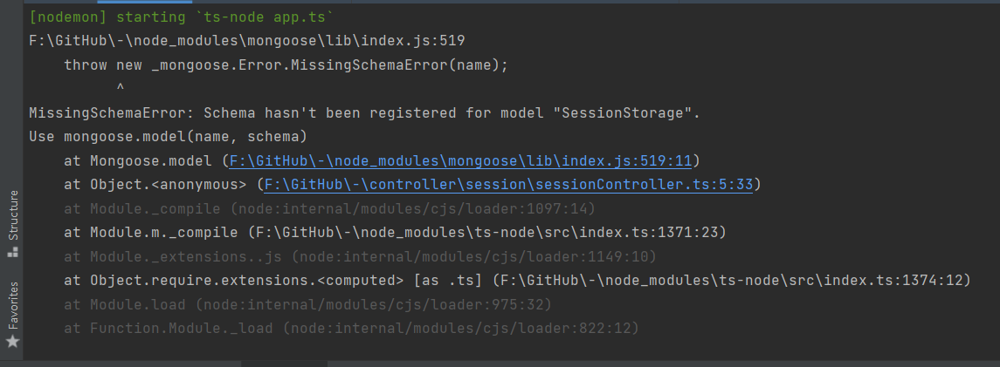

涉及文件：

- config/session.config.ts session 的存储
- controller/sessionController.ts
- models/database.ts
- models/session/sessionStorageSchema.ts

可能是 MongDB 数据库的 Model 没有在链上；
我还看到在 Schema 文件中的 key 要求是全小写，总之不是很清楚

---

**2022-03-04** Fix Log
rNLKJA

1. 检查 sessionController.ts 文件，删除 sessionController.ts 10 行，17 行 export 语法。
2. 更改 session.config.ts 导入，将 `import {setSession} from'../controller/session/sessionController'` 更变为 `const sessionController = require('../controller/session/sessionController')`。
3. 检查 Mongoose 注册问题，经查 MongoDB 无对应 collection，创建 collection sessionStorage。
4. 尝试添加 sessionRouter，经查此问题可能是是因为程序先调用 schema 后导入所造成的问题，尝试更改调用数据库的位置。错误更变 express-session API, `TypeError: store.on is not a function`。
5. 将 13, 14, 39, 40 有关 session 方程移除，程序正常运行。

后续问题及解决思路：

需要重新实现 session 存储方式：

- session.config.ts, sessionConfig 中，属性 store 可能不存在，需要另外调用已知路由储存当前 session。
- 或 session.config.ts, sessionConfig 中，属性 store 必须为 boolean，不为 callback function，可选择性修改 sessionController 以储存用户 session。

存储 session 是否需要加密问题：

- 可尝试使用 jwt 或 bycrpyt 对数据进行加密处理进行存储，进一步增加数据安全性。
- 或将 session 直接存储于服务器本地
